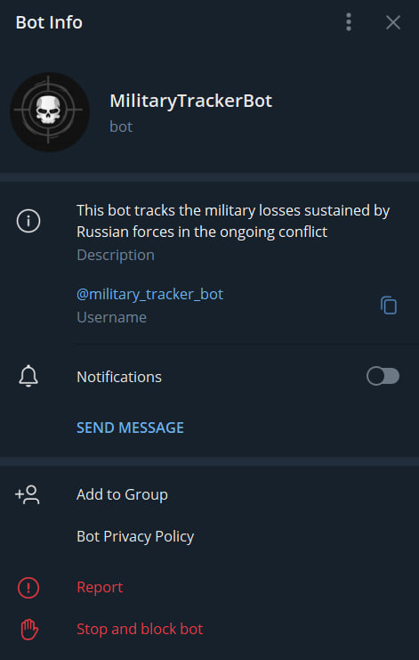
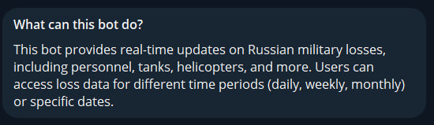
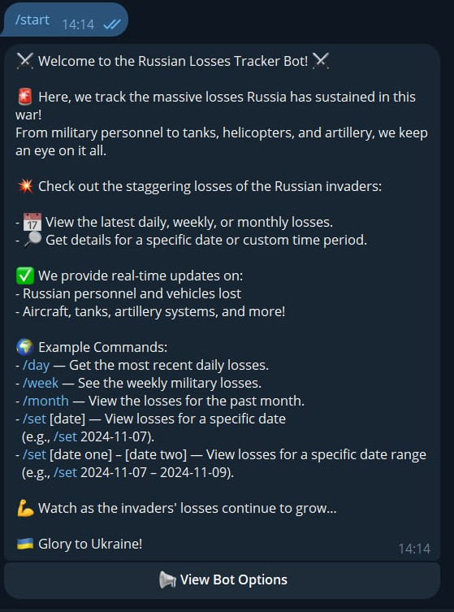
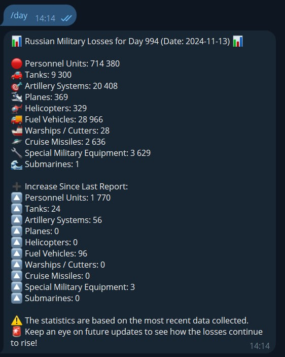
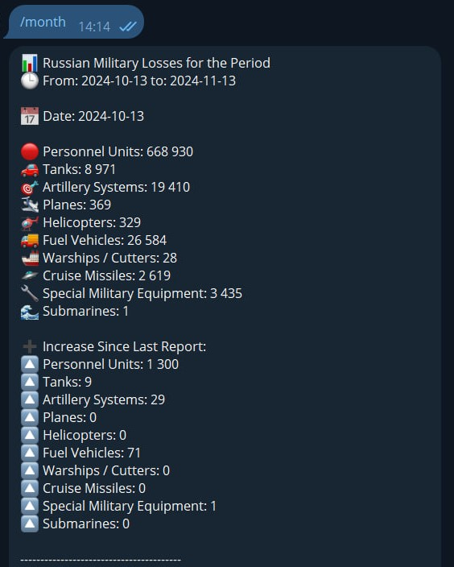
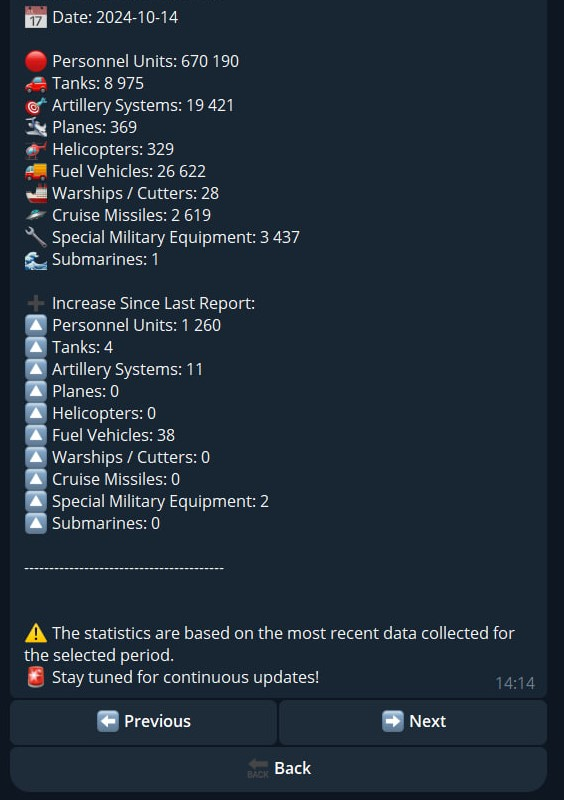
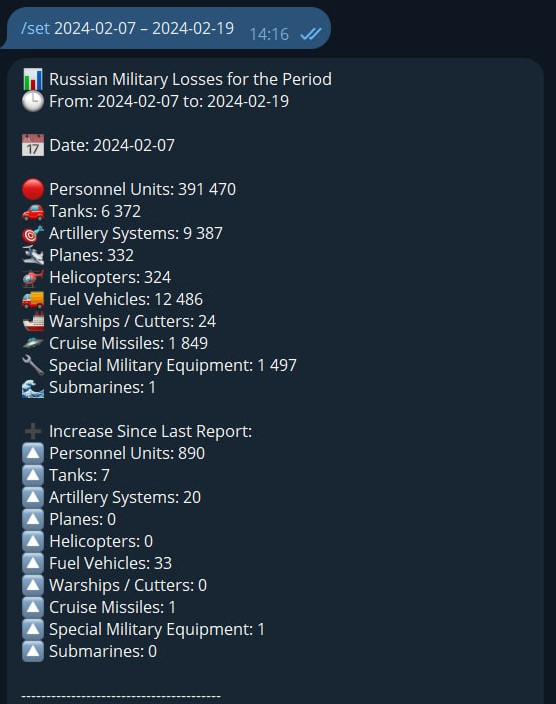
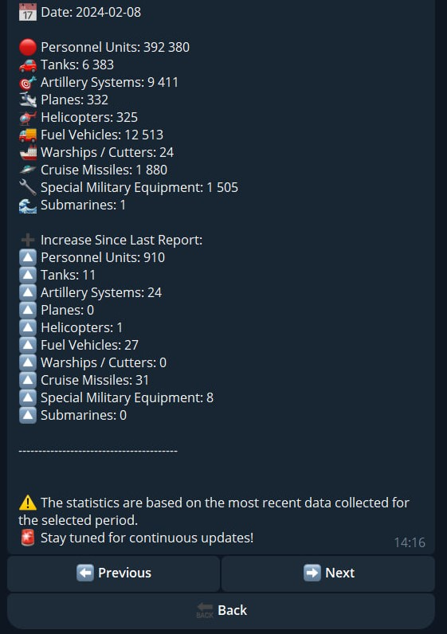

# Telegram_MilitaryTrackerBot Project

The **Telegram Military Tracker Bot** allows users to track the ongoing military losses of Russian forces in the ongoing conflict. Users can easily retrieve real-time statistics about the losses in different categories, such as personnel, tanks, helicopters, and more. The bot provides several commands to view data for different time periods or specific dates, ensuring up-to-date and accurate information.

## Features
- **Real-Time Losses**: Track Russian military losses including personnel, tanks, planes, artillery, helicopters, warships, and more.
- **Multiple Time Periods**: View daily, weekly, monthly, or custom date range losses.
- **Easy Commands**: Use simple commands to get up-to-date loss statistics or specify custom date ranges.
- **Instant Updates**: Get immediate updates with the latest data as it becomes available.

## Description
The **Telegram Military Tracker Bot** provides a straightforward way to stay updated on the military losses sustained by Russian forces. By using simple commands, users can access detailed loss statistics based on daily, weekly, or monthly data. Additionally, the bot allows for queries on specific dates or date ranges.

Once a user interacts with the bot, they are presented with a variety of statistics, including personnel, tanks, helicopters, planes, and other military equipment lost during the war. The bot continuously provides updates, offering users a comprehensive view of the ongoing situation.

### Commands
The bot operates through a set of commands designed to retrieve loss data for different periods:

- **/day** — Get the most recent daily losses.
- **/week** — See the weekly military losses.
- **/month** — View the losses for the past month.
- **/set [date]** — View losses for a specific date (e.g., `/set 2024-11-07`).
- **/set [date one] – [date two]** — View losses for a specific date range (e.g., `/set 2024-11-07 – 2024-11-09`).
- **/start** — Start the bot and receive a welcome message.
- **/help** — Display the help message with more details on bot usage.

## Bot Interface

### Bot Info

### What the Bot Can Do
- **Real-Time Losses**: Track military losses in multiple categories.
- **View Losses by Period**: Check daily, weekly, or monthly losses.
- **Custom Date Queries**: Look up losses by a specific date or date range.

### Example Commands and Behavior

1. **Welcome Message**:
   When the user starts the bot, they receive a welcome message detailing how to use the bot.

   

2. **Daily Losses**:
   Command `/day` shows the most recent losses for the day.

   

3. **Monthly Losses**:
   Command `/month` displays losses for the past month.

   
   

4. **Date Range Query**:
   Command `/set 2024-11-07 – 2024-11-09` shows losses for a specific date range.

   
   

### Error Handling

If the bot encounters any issues, such as invalid input or data fetching errors, it will send informative error messages to guide the user:

- **Invalid Input**: If the user inputs an incorrect command or date format, the bot will display an error message with guidance.
- **No Data Found**: If no loss data is available for the requested period, the bot will notify the user and encourage them to check back later.
- **Internal Errors**: In case of issues retrieving the loss data, the bot will show an error message and suggest retrying later.