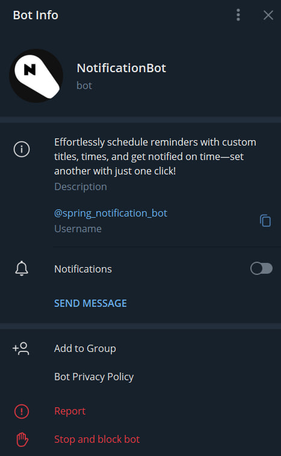
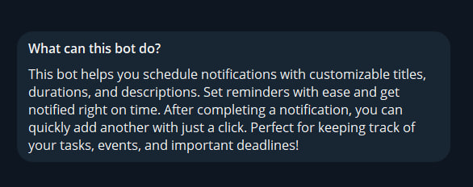
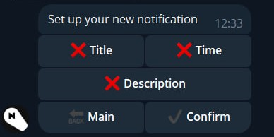
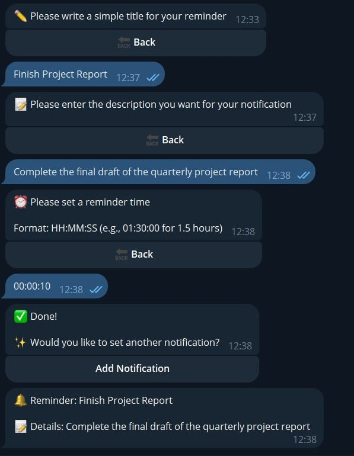

# Telegram_NotificationBot Project
Notification bot helps you schedule reminders with customizable titles, durations, and descriptions, ensuring you never miss important tasks, events, or deadlines.

## Features
- **Custom Reminders**: Set titles, times, and descriptions for your notifications.
- **Efficient Notifications**: Receive timely reminders and quickly add new ones as needed.
- **User-Friendly**: Easily access main functions through Telegram commands or buttons.

## Description
NotificationBot offers a seamless way to organize your tasks, events, and deadlines. The bot allows users to create and customize notifications effortlessly. With options for setting specific titles, descriptions, and alert times, it’s designed to help you stay organized and on schedule. Once a notification is completed, setting up a new one is just a click away, making it ideal for managing recurring tasks or last-minute reminders.

## Bot Interface

### Bot Info

### What the Bot Can Do

### Set Up Notification

### Example of Behavior
