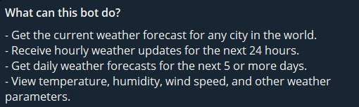

# Telegram_WeatherBot Project
WeatherBot is a Telegram bot that provides real-time weather forecasts using the WeatherBit API. It allows users to check weather conditions in their city for different periods, whether they need a quick 24-hour forecast or a more detailed 5-day forecast.

## Features
- **Weather Forecasts**: Get accurate weather data for any city in the world.
- **Hourly & Daily Forecasts**: Choose between a 24-hour forecast or a 5-day forecast.
- **Simple Commands**: Get started quickly by typing a city name followed by the desired forecast mode (e.g., '24h' for hourly or '5d' for daily).
- **User-Friendly**: Intuitive interface that makes it easy to get the weather at your fingertips.

## Description
WeatherBot is designed to deliver weather information in a quick and easy-to-understand format. Powered by the WeatherBit API, the bot provides up-to-date and reliable forecasts. Whether you're planning your day or preparing for the upcoming week, WeatherBot delivers essential weather data at your convenience. You can easily check conditions for any city and select whether you need a detailed hourly forecast for the next 24 hours or a broader 5-day outlook.

## Bot Interface

### Bot Info

### What the Bot Can Do

### Example of Forecast Response
